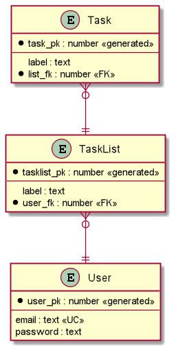

# MySQL database

### Entity relationship diagram



### Creation file

```sql
DROP TABLE IF EXISTS Task;
DROP TABLE IF EXISTS List;
DROP TABLE IF EXISTS User;

CREATE TABLE User (
    user_pk int NOT NULL AUTO_INCREMENT,
    email varchar(255) NOT NULL,
    PRIMARY KEY (user_pk),
    CONSTRAINT UC_Email_User UNIQUE (email)
);

CREATE TABLE List (
    list_pk int NOT NULL AUTO_INCREMENT,
    label varchar(255) NOT NULL,
    user_fk int NOT NULL,
    PRIMARY KEY (list_pk),
    CONSTRAINT FK_user_List FOREIGN KEY (user_fk) REFERENCES user (user_pk)
);

CREATE TABLE Task (
    task_pk int NOT NULL AUTO_INCREMENT,
    label varchar(255) NOT NULL,
    list_fk int NOT NULL,
    PRIMARY KEY (task_pk),
    CONSTRAINT FK_List_Task FOREIGN KEY (list_fk) REFERENCES List (list_pk)
);
```

### Insertion file

```sql
INSERT INTO User (email)
VALUES ('user1@test.com'),
       ('user2@test.com');

INSERT INTO List (label, user_fk)
VALUES ('List1', 1),
       ('List1', 2),
       ('List2', 2);

INSERT INTO Task (label, list_fk)
VALUES ('Task1', 1),
       ('Task2', 1),
       ('Task1', 2),
       ('Task1', 3),
       ('Task2', 3);
```